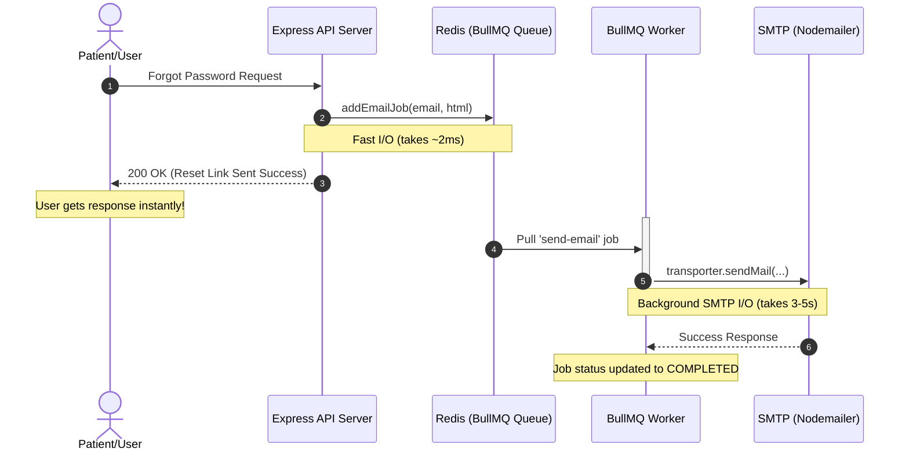

# Life Care Plus - BullMQ Integration & Background Jobs

এই প্রজেক্টের পারফরম্যান্স, স্কেলাবিলিটি এবং নির্ভরযোগ্যতা (reliability) বৃদ্ধি করার জন্য **BullMQ** ব্যাকগ্রাউন্ড জব প্রসেসর ইন্টিগ্রেট করা হয়েছে। নিচে বর্তমানে সম্পন্ন হওয়া কাজ এবং এর কার্যপ্রণালী আলোচনা করা হলো।

---

## এখন পর্যন্ত যে কাজগুলো করা হয়েছে (Current Progress)

### ১. BullMQ লাইব্রেরি ইনস্টলেশন
ব্যাকগ্রাউন্ড কিউ এবং ওয়ার্কার ম্যানেজ করার জন্য `bullmq` লাইব্রেরি ইনস্টল করা হয়েছে।

### ২. ডেডিকেটেড Redis কানেকশন ম্যানেজমেন্ট
* **ফাইল:** [connection.ts](file:///home/mehedimehad/project/life-care-plus/server/src/app/jobs/connection.ts)
* **কাজ:** BullMQ-এর কিউ (Queue) এবং ওয়ার্কার (Worker)-এর জন্য আলাদা `ioredis` ইনস্টেন্স তৈরি করার লজিক ইম্প্লিমেন্ট করা হয়েছে। এর মাধ্যমে ব্রপো পপ/ব্লকিং (blocking) কমান্ডগুলো মেইন অ্যাপ্লিকেশন ডাটাবেজ বা ক্যাশ কানেকশনকে স্টল (stall) করতে পারে না।

### ৩. ইমেইল কিউ ডিফাইন করা (Email Dispatch Queue)
* **ফাইল:** [email.queue.ts](file:///home/mehedimehad/project/life-care-plus/server/src/app/jobs/email.queue.ts)
* **কাজ:** ইমেইল কিউ তৈরির জন্য `emailQueue` এবং নতুন ইমেইল জব কিউতে যুক্ত করার জন্য `addEmailJob` হেল্পার ফাংশন তৈরি করা হয়েছে।
* **ফিচার:**
  * **Retries:** ইমেইল সেন্ডিং ফেইল করলে স্বয়ংক্রিয়ভাবে ৩ বার চেষ্টা (attempts) করবে।
  * **Exponential Backoff:** প্রথমবার ফেইল করার পর ৫ সেকেন্ড, এরপর ১০ সেকেন্ড এবং তারপর ২০ সেকেন্ড পর রিট্রাই করবে।
  * **Automatic Cleanup:** সফল হওয়া জবের ডেটা স্বয়ংক্রিয়ভাবে মুছে যাবে যেন Redis মেমোরি খালি থাকে। ব্যর্থ হওয়া জবের ডেটা ট্র্যাকিংয়ের জন্য সিস্টেমে থেকে যাবে।

### ৪. ইমেইল ওয়ার্কার ইম্প্লিমেন্টেশন (Email Dispatch Worker)
* **ফাইল:** [email.worker.ts](file:///home/mehedimehad/project/life-care-plus/server/src/app/jobs/email.worker.ts)
* **কাজ:** কিউ থেকে ইমেইলগুলো প্রসেস করার জন্য একটি ডেডিকেটেড ওয়ার্কার তৈরি করা হয়েছে যা ব্যাকগ্রাউন্ডে nodemailer ব্যবহার করে ইমেল পাঠায়।
* **ফিচার:**
  * **Concurrency:** একসাথে সর্বোচ্চ ৫টি ইমেইল কনকারেন্টলি (সমান্তরালভাবে) প্রসেস করতে পারে।

### ৫. গ্লোবাল জব ম্যানেজার এবং লাইফসাইকেল কন্ট্রোল
* **ফাইল:** [jobs/index.ts](file:///home/mehedimehad/project/life-care-plus/server/src/app/jobs/index.ts)
* **কাজ:** সব ওয়ার্কার এক জায়গায় রেজিস্ট্রি করা এবং সার্ভার স্টার্ট বা স্টপ হওয়ার সময় ওয়ার্কারদের লাইফসাইকেল কন্ট্রোল করা।

### ৬. এক্সপ্রেস সার্ভার বুটস্ট্র্যাপ এবং গ্রেসফুল শাটডাউন
* **ফাইল:** [server.ts](file:///home/mehedimehad/project/life-care-plus/server/src/server.ts)
* **কাজ:** 
  * এক্সপ্রেস সার্ভার রান হওয়ার সাথে সাথে ব্যাকগ্রাউন্ড ওয়ার্কার চালু করতে `initializeJobs()` রান করা হয়েছে।
  * সার্ভার বন্ধ বা ক্র্যাশ হলে (যেমন: `SIGTERM`, `SIGINT`, বা `unhandledRejection` এর মাধ্যমে) ওয়ার্কারগুলো যেন ডেটা লস ছাড়া গ্রেসফুলি শাটডাউন হতে পারে, তার জন্য `closeJobs()` লজিক যুক্ত করা হয়েছে।

### ৭. পাসওয়ার্ড রিসেট ইমেইল কিউতে যুক্ত করা
* **ফাইল:** [auth.service.ts](file:///home/mehedimehad/project/life-care-plus/server/src/app/modules/auth/auth.service.ts)
* **কাজ:** `forgotPassword` রিকোয়েস্টে সরাসরি SMTP কলের মাধ্যমে ইমেইল পাঠানোর বদলে `addEmailJob` ব্যবহার করে কিউতে টাস্কটি পুশ করা হয়েছে। এর ফলে ইউজার তাৎক্ষণিকভাবে রেসপন্স পাবেন।

---

## কাজের প্রবাহ (Workflow Architecture)



---

## কিভাবে রান করবেন (How to Run & Test)

1. নিশ্চিত করুন আপনার কম্পিউটারে Redis সার্ভার রানিং আছে।
2. সার্ভার স্টার্ট করুন:
   ```bash
   npm run dev
   ```
3. কনসোলে নিচের মেসেজগুলো দেখতে পাবেন:
   ```text
   Redis connected successfully
   ⚙️ Initializing Background Jobs and Workers...
   ✅ 1 Worker(s) initialized successfully.
   ```
4. পাসওয়ার্ড রিসেট করার রিকোয়েস্ট পাঠালে ব্যাকগ্রাউন্ডে নিচের লগগুলো দেখতে পাবেন:
   ```text
   📧 Processing email job <job-id> for <user-email>
   ✅ Email successfully sent to <user-email>
   🎉 Email Job <job-id> has completed successfully.
   ```

---

## পরবর্তী পরিকল্পনা (Next Steps)
- [x] **বাল্ক ও রোল-ভিত্তিক নোটিফিকেশন কিউ:** `NotificationService.emitToRole` কিউতে কনভার্ট করা।
- [ ] **ক্রন জব রিপ্লেসমেন্ট:** `node-cron` পরিবর্তন করে BullMQ Repeatable Jobs ব্যবহার করা।
- [ ] **স্ট্রাইপ ওয়েবহুক প্রসেসিং:** পেমেন্ট স্ট্যাটাস কিউতে আপডেট করা।
