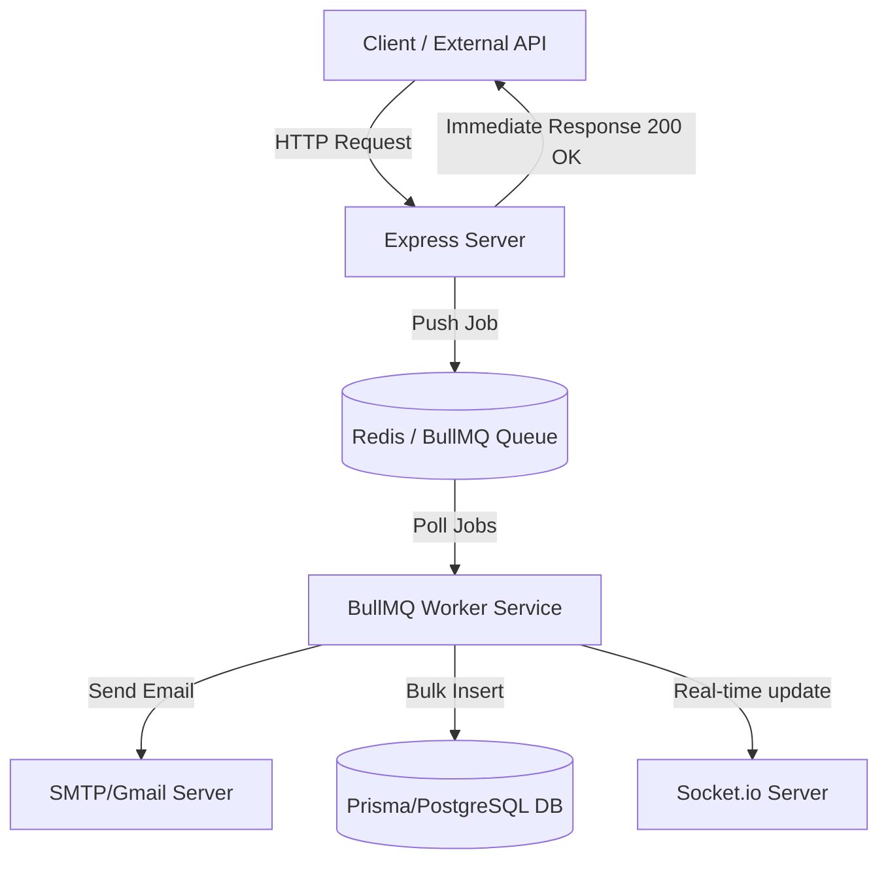

# Life Care Plus: BullMQ Integration Recommendations

আমাদের **Life Care Plus** প্রজেক্টটিতে Redis অলরেডি ইন্টিগ্রেট করা আছে ক্যাশিংয়ের জন্য। BullMQ-ও Redis ব্যবহার করে ব্যাকগ্রাউন্ড প্রসেসিং এবং কিউ (Queue) ম্যানেজমেন্ট করে। অ্যাপ্লিকেশনের পারফরম্যান্স, স্কেলাবিলিটি এবং নির্ভরযোগ্যতা (reliability) বাড়ানোর জন্য নিচে উল্লেখিত জায়গাগুলোতে BullMQ ব্যবহার করা সবচেয়ে ভালো হবে:

---

## ১. ইমেইল পাঠানো (Email Dispatching Queue)
* **কোথায়:** [auth.service.ts](file:///home/mehedimehad/project/life-care-plus/server/src/app/modules/auth/auth.service.ts) ফাইলের `forgotPassword` ফাংশনে (যা [emailSender.ts](file:///home/mehedimehad/project/life-care-plus/server/src/app/modules/auth/emailSender.ts) কল করে)।
* **বর্তমান সমস্যা:** বর্তমানে পাসওয়ার্ড রিসেট ইমেইল সরাসরি সিনক্রোনাসভাবে (synchronously) পাঠানো হচ্ছে। SMTP সার্ভারের সাথে কানেক্ট হয়ে ইমেইল পাঠাতে সাধারণত ৩-৫ সেকেন্ড বা তার বেশি সময় লাগে। এই সময় পর্যন্ত ইউজারকে রেসপন্সের জন্য অপেক্ষা করতে হয়।
* **কেন BullMQ ব্যবহার করবেন:**
  * **রেসপন্স টাইম কমানো:** ইউজার পাসওয়ার্ড রিসেট রিকোয়েস্ট করার পর ইমেইল টাস্কটি কিউতে (Queue) পুশ করেই সাথে সাথে ইউজারকে রেসপন্স দিয়ে দেওয়া যাবে। ইউজারকে মেইল পাঠানো শেষ হওয়া পর্যন্ত অপেক্ষা করতে হবে না।
  * **অটোমেটিক রিট্রাই (Automatic Retry):** কোনো কারণে SMTP সার্ভার সাময়িকভাবে ডাউন থাকলে বা রেট-লিমিটের মুখোমুখি হলে, BullMQ স্বয়ংক্রিয়ভাবে ব্যাক-অফ টাইম (exponential backoff) সহ রিট্রাই করবে।

---

## ২. রোল-ভিত্তিক এবং বাল্ক নোটিফিকেশন (Bulk/Role-based Notifications Queue)
* **কোথায়:** [notification.service.ts](file:///home/mehedimehad/project/life-care-plus/server/src/app/modules/notification/notification.service.ts) ফাইলের `emitToRole` ফাংশনে।
* **বর্তমান সমস্যা:** কোনো নির্দিষ্ট রোলের (যেমন: `ADMIN` বা `PATIENT`) সকল ইউজারকে নোটিফিকেশন পাঠানোর সময় ডেটাবেজে `prisma.notification.createMany` দিয়ে একযোগে প্রচুর এন্ট্রি তৈরি করা হয় এবং একই সাথে সকেট কানেকশনে ব্রডকাস্ট করা হয়।
* **কেন BullMQ ব্যবহার করবেন:**
  * সিস্টেমে হাজার হাজার পেশেন্ট বা ডাক্তার থাকলে, একবারে সবার জন্য ডেটাবেজ এন্ট্রি তৈরি করা এবং সকেট কানেকশনে পুশ করা সার্ভারের ইভেন্ট লুপকে (Event Loop) ব্লক করে দিতে পারে।
  * এটিকে ব্যাকগ্রাউন্ড কিউতে নিয়ে প্রসেস করলে মূল এপিআই সার্ভার সবসময় ফাস্ট থাকবে এবং সার্ভারে মেমোরি স্পাইক (Memory Spike) হবে না।

---

## ৩. ক্রন জব বা রিপিটেবল জবস (Replacing node-cron with Repeatable Jobs)
* **কোথায়:** [app.ts](file:///home/mehedimehad/project/life-care-plus/server/src/app.ts) ফাইলে থাকা আনপেইড অ্যাপয়েন্টমেন্ট বাতিল করার ক্রন জব (`cron.schedule('*/5 * * * *')`)।
* **বর্তমান সমস্যা:** বর্তমানে `node-cron` লাইব্রেরি ব্যবহার করে প্রতি ৫ মিনিট পর পর ইন-মেমোরিতে `AppointmentService.cancelUnpaidAppointments()` চালানো হচ্ছে।
* **কেন BullMQ ব্যবহার করবেন:**
  * **ডিস্ট্রিবিউটেড লক ও হরিজন্টাল স্কেলিং (Distributed Locking):** প্রোডাকশন লেভেলে যখন আপনি অ্যাপ্লিকেশনটি একাধিক ইন্সটেন্সে রান করবেন (যেমন: PM2 ক্লাস্টার মোড অথবা মাল্টিপল ডকার কন্টেইনার/সার্ভার), তখন `node-cron` প্রতিটি ইন্সটেন্সে আলাদাভাবে এবং একই সময়ে রান করবে। এতে ডেটাবেজে ডুপ্লিকেট কুয়েরি এবং ডেটা রেস কন্ডিশন (Race Condition) তৈরি হবে।
  * **একবার এক্সিকিউশন (Exactly-once execution):** BullMQ-এর *Repeatable Jobs* ব্যবহার করলে Redis-এর মাধ্যমে শুধুমাত্র একটি কন্টেইনার বা ইন্সটেন্স একবারে এই ক্রন জবটি এক্সিকিউট করবে।

---

## ৪. স্ট্রাইপ ওয়েব হুক প্রসেসিং (Stripe Webhook Processing Queue)
* **কোথায়:** [payment.service.ts](file:///home/mehedimehad/project/life-care-plus/server/src/app/modules/payment/payment.service.ts) ফাইলের `handleStripeWebhookEvent` ফাংশনে।
* **বর্তমান সমস্যা:** স্ট্রাইপ থেকে পেমেন্ট সফল বা ব্যর্থ হওয়ার পর যখন ওয়েব হুক আসে, তখন সরাসরি ডেটাবেজ ট্রানজেকশন, অ্যাপয়েন্টমেন্ট আপডেট এবং নোটিফিকেশন প্রসেস করা হয়।
* **কেন BullMQ ব্যবহার করবেন:**
  * স্ট্রাইপ চায় যে তাদের ওয়েব হুক কল যেন খুব দ্রুত (২-৩ সেকেন্ডের মধ্যে) `200 OK` রেসপন্স পায়। যদি আপনার সিস্টেমে বেশি ট্রানজেকশনাল কাজ বা ডেটাবেজ লকিং ঘটে এবং ওয়েব হুক ফেইল করে, স্ট্রাইপ পুনরায় হুক কল করবে, যা অনেক সময় ডুপ্লিকেট পেমেন্ট আপডেটের কারণ হতে পারে।
  * ওয়েব হুক রিকোয়েস্ট পাওয়ামাত্রই পে-লোডটি BullMQ-তে পুশ করে স্ট্রাইপকে সাথে সাথে `200 OK` রেসপন্স দিয়ে দেওয়া উচিত। এরপর ব্যাকগ্রাউন্ডে পেমেন্ট স্ট্যাটাস আপডেট, ট্রানজেকশন রেকর্ড এবং নোটিফিকেশন পাঠানো সম্পন্ন হবে।

---

## ৫. অ্যাপয়েন্টমেন্ট রিমাইন্ডার (Delayed Appointment Reminders - Future Feature)
* **কোথায়:** একটি নতুন ফিচার হিসেবে।
* **কেন BullMQ ব্যবহার করবেন:**
  * ডাক্তার দেখানোর ২৪ ঘণ্টা বা ১ ঘণ্টা আগে পেশেন্ট ও ডাক্তারকে নোটিফিকেশন বা ইমেইল রিমাইন্ডার পাঠানো।
  * BullMQ-এর **Delayed Job** ফিচার ব্যবহার করে খুব সহজেই এটি করা যায়। অ্যাপয়েন্টমেন্ট বুকিংয়ের সময়ই রিমাইন্ডার কিউতে একটি বিলম্বিত জব যোগ করে রাখা যায় যা নির্দিষ্ট সময়ে (যেমন: অ্যাপয়েন্টমেন্টের ১ ঘণ্টা আগে) রান হবে। প্রতি মিনিটে ডেটাবেজে সার্চ করার চেয়ে এটি অনেক বেশি পারফর্মিং এবং ক্লিন সলিউশন।

---

## সংক্ষিপ্ত আর্কিটেকচার উদাহরণ (Architecture Diagram)

## সারাংশ
যেহেতু আপনার প্রজেক্টে অলরেডি Redis সেটআপ করা আছে, তাই BullMQ ব্যবহারের জন্য কোনো অতিরিক্ত থার্ড-পার্টি সার্ভিস ইনস্টল বা সেটআপ করতে হবে না। শুধুমাত্র `bullmq` লাইব্রেরি ইনস্টল করে একটি জেনেরিক Queue এবং Worker আর্কিটেকচার তৈরি করলেই প্রজেক্টটি প্রোডাকশন-রেডি ও অত্যন্ত ফাস্ট হবে।
